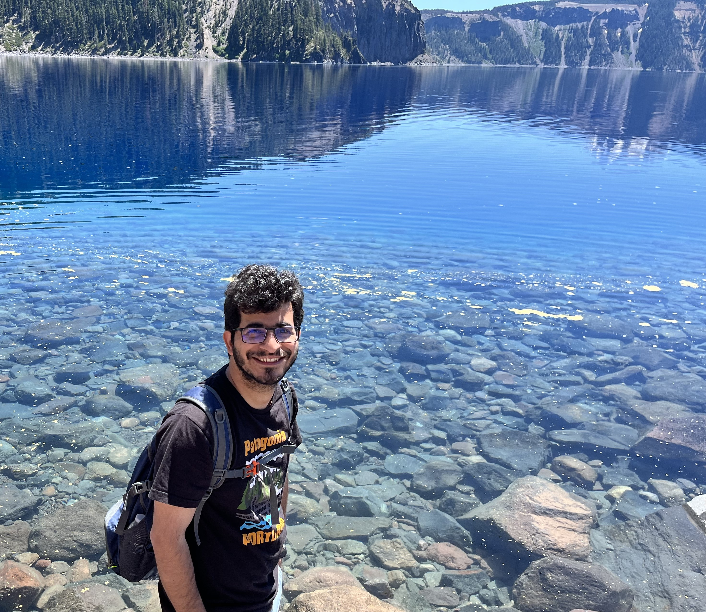

# About

Hi, My name is Lakshya. Thank you for visiting me here. "Cognitive Chaos" is my personal blog where I write about topics that interest me.

---
<!-- 

  

  

 -->

I'm a Machine Learning Engineer at Intel, where I specialize in developing deep learning models for semiconductor manufacturing. My work focuses on defect classification using computer vision, image generation with GANs, and building scalable MLOps infrastructure.

## Academic Background
I completed my Ph.D. in Physics from the [University of Kentucky](https://www.uky.edu) in 2021, where my research centered on computational nuclear and particle physics. [My dissertation](https://uknowledge.uky.edu/physastron_etds/82/) involved conducting Maximum Likelihood analysis of neutron beta decay to investigate potential new physics signatures in Beyond Standard Model Physics. I focused on analyzing the neutron $\beta$-decay spectrum using Monte Carlo simulations that generated terabytes of data. Theoretical estimates of various beyond standard model parameters were computed at different confidence levels to provide benchmarks for future experiments.

Apart from neutron $\beta$-decay, I also worked on theoretical high energy physics. In particular, I investigated how electromagnetic fields interact with accelerating relativistic particles and demonstrated the necessity of correction terms to account for Thomas rotation effects from particle acceleration. This work identified previously unrecognized higher-order terms that enhance the accuracy of interpreting experimental results in high-energy particle physics.

Following my Ph.D., I conducted postdoctoral research at the [University of Wisconsin-Madison](https://www.wisc.edu/) and [DIII-D at General Atomics](https://www.ga.com/magnetic-fusion/diii-d) in San Diego, California for about a year. My research focused on applications of deep learning methods to [plasma fusion physics](https://en.wikipedia.org/wiki/Fusion_power). [Plasma or nuclear fusion](https://en.wikipedia.org/wiki/Nuclear_fusion) is the process that powers the sun and other stars in our universe and has tremendous potential for offering nearly [limitless clean energy](https://www.ga.com/magnetic-fusion/promise-of-fusion). At DIII-D, I worked on plasma stability and control. I developed models to predict disruptive [Edge Localized Mode (ELM)](https://en.wikipedia.org/wiki/Edge-localized_mode) events—instabilities that can damage reactor vessels in fusion reactors. Real-time spatio-temporal data from 2-D beam emission spectroscopy systems was analyzed with these ML models. They have the ability to predict ELM onset 200 milliseconds in advance, enabling protective measures to safeguard expensive reactor equipment.

## Professional Work
At Intel, I've led initiatives including the development of SEMImageNet—a 5-million-image dataset from [SEM (scanning electron microscope)](https://en.wikipedia.org/wiki/Scanning_electron_microscope) images from 200+ semiconductor manufacturing process modules, mirroring the ImageNet concept for transfer learning applications. Various neural network architectures were trained on this dataset for defect classification tasks. These models have shown excellent prediction capabilities with and without fine-tuning techniques. The deployed production models achieve over 10% performance improvements on multiple modules across various technologies. I've also managed GPU clusters on Intel cloud infrastructure, scaling training operations to over 200 models every week, and reduced model deployment turnaround time by over 80% through automated end-to-end pipelines.

Apart from defect classification, I've worked on generative models such as Generative Adversarial Networks to generate raw SEM images of healthy dies in semiconductor wafers with the help of design clips. This technique significantly improved the throughputs of SEM tools by requiring fewer images per site.

Besides these, I'm also working on various pathfinding projects where I research and implement different ideas like vision-language models and attention techniques to make the models focus on regions containing defects in SEM images.

## Beyond Work
With all this machine learning business at work, my love for physics is not completely lost. I'm continuously researching ideas that can satisfy my hunger for working on physics problems leveraging artificial intelligence.

I do have a life outside of machine learning :). I love going to hiking trails and capturing beautiful landscapes with my camera.

Hope you find whatever you're reading here helpful!

